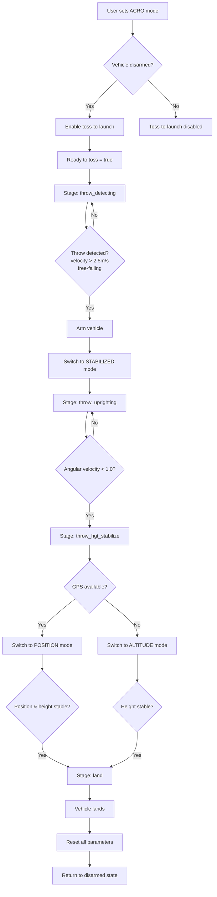

# PX4 Toss-to-Launch Implementation

## Overview

This repository contains a custom implementation of **Toss-to-Launch** functionality for PX4 autopilot, developed by dviresh93. This feature allows a multicopter to automatically arm, stabilize, and enter controlled flight when thrown into the air, eliminating the need for manual throttle-up during launch.

## Key Features

- **Automatic throw detection** using velocity and acceleration thresholds
- **Safe arming sequence** that only activates during actual throw motion  
- **Intelligent flight mode progression** from throw detection to stable hover to landing
- **Safety mechanisms** to prevent accidental activation and ensure controlled operation
- **ACRO mode integration** as the activation trigger while preventing manual control

## Implementation Details

The toss-to-launch functionality is primarily implemented in the Commander module (`src/modules/commander/Commander.cpp`) with supporting modifications in the multicopter rate controller.

### Core Components

#### 1. Throw Detection State Machine

The implementation uses a finite state machine with the following stages:

```cpp
enum throw_stage{
    throw_disarmed = 0,      // Initial state, waiting for conditions
    throw_detecting,         // Monitoring for throw motion
    throw_uprighting,        // Vehicle stabilizing after throw
    throw_hgt_stabilize,     // Height and position control
    land,                    // Landing sequence
};
```

#### 2. Activation Logic (`src/modules/commander/Commander.cpp:2543-2559`)

- **Mode Trigger**: ACRO flight mode selection
- **Safety Condition**: Vehicle must be disarmed
- **RC Requirement**: Valid RC signal must be present
- **Throttle Independence**: No longer requires zero throttle (removed in commit 06cede9c5f)

#### 3. Throw Detection Algorithm (`src/modules/commander/Commander.cpp:2712-2720`)

```cpp
bool Commander::throw_detected(){
    const vehicle_local_position_s &lpos = _local_position_sub.get();
    
    // Calculate total velocity magnitude
    float squared_vel = std::pow(lpos.vx, 2) + std::pow(lpos.vy, 2) + std::pow(lpos.vz, 2);
    float throw_rate = std::sqrt(squared_vel);
    
    // Check for free-fall condition (reduced gravity)
    bool free_falling = lpos.az > -0.25f * 9.80655f;
    
    // Trigger on combined velocity and free-fall conditions
    return (throw_rate > 2.5f && free_falling);
}
```

**Detection Criteria:**
- **Velocity Threshold**: Total 3D velocity > 2.5 m/s
- **Free-Fall Detection**: Vertical acceleration > -0.25g (indicating reduced apparent gravity)

#### 4. Stabilization Checks

**Altitude Stabilization** (`Commander::throw_altitude_good()`):
- Monitors angular velocity magnitude < 1.0 rad/s
- Ensures vehicle orientation is stable before mode transition

**Height Control** (`Commander::throw_height_good()`):
- Vertical velocity within ±0.5 m/s range
- Indicates stable hover condition

**Position Control** (`Commander::throw_position_good()`):
- Horizontal position error < 0.5m (when GPS available)
- Ensures precise positioning before landing

### Safety Features

#### 1. ACRO Mode Lockout (`src/modules/mc_rate_control/MulticopterRateControl.cpp:210-240`)

```cpp
// Disabled manual control in ACRO mode for toss-to-launch safety
const Vector3f man_rate_sp{
    math::superexpo(0.0f, _param_mc_acro_expo.get(), _param_mc_acro_supexpo.get()),
    math::superexpo(0.0f, _param_mc_acro_expo.get(), _param_mc_acro_supexpo.get()),
    math::superexpo(0.0f, _param_mc_acro_expo_y.get(), _param_mc_acro_supexpoy.get())
};
_thrust_sp = 0.0f;  // Zero thrust command
```

This prevents manual control if a user accidentally arms in ACRO mode outside of toss-to-launch.

#### 2. Pre-flight Check Modifications (`src/modules/commander/Arming/PreFlightCheck/checks/accelerometerCheck.cpp:76-88`)

- **Accelerometer range check disabled** during toss-to-launch to prevent "hold still on arming" errors
- Allows arming during dynamic motion of throwing

#### 3. Arming Permission (`src/modules/commander/Commander.cpp:812-824`)

- **ACRO mode exemption** from throttle-zero requirement for arming
- Enables arming during throw detection without manual throttle control

## Flight Sequence Flow



## State Transitions

### Stage 1: throw_disarmed
- **Entry Conditions**: ACRO mode + disarmed + RC signal present
- **Actions**: Set `ready_to_toss = true`
- **Exit Condition**: Manual trigger to `throw_detecting`

### Stage 2: throw_detecting  
- **Entry**: From `throw_disarmed` when ready
- **Actions**: Monitor velocity and acceleration
- **Exit**: When throw detected → arm vehicle → `throw_uprighting`

### Stage 3: throw_uprighting
- **Entry**: After throw detection and arming
- **Actions**: Switch to STABILIZED mode, monitor angular rates
- **Exit**: When `angular_velocity < 1.0` → `throw_hgt_stabilize`

### Stage 4: throw_hgt_stabilize
- **Entry**: Vehicle orientation stable
- **Actions**: 
  - If GPS: Switch to POSITION mode
  - If no GPS: Switch to ALTITUDE mode
- **Exit**: When position/height stable → `land`

### Stage 5: land
- **Entry**: Vehicle in stable hover
- **Actions**: Automatic landing sequence (currently simplified)
- **Exit**: When landed → reset parameters

## Code Modifications Summary

### Files Modified:

1. **`src/modules/commander/Commander.cpp`** - Main implementation
   - State machine logic
   - Throw detection algorithms  
   - Mode transition handling
   - Safety parameter management

2. **`src/modules/commander/Commander.hpp`** - Header definitions
   - Function declarations for throw detection
   - Additional uORB subscriptions for vehicle rates

3. **`src/modules/mc_rate_control/MulticopterRateControl.cpp`** - Safety lockout
   - Disabled manual rate control in ACRO mode
   - Zero thrust enforcement

4. **`src/modules/commander/Arming/PreFlightCheck/checks/accelerometerCheck.cpp`** - Pre-flight modifications
   - Disabled accelerometer range check during dynamic arming

### Key Commits:

- **98efc48356**: Initial toss-to-launch implementation and testing
- **a425b28916**: Arming logic - arms when throw detected, prevents prop spinning while holding
- **84e421cf23**: ACRO mode safety - disabled rate commands to prevent manual flight
- **06cede9c5f**: Removed throttle hold requirement and preflight accel check
- **8cb3e16f53**: ACRO transition denial when already armed (safety feature)

## Usage Instructions

1. **Setup**: Ensure vehicle is disarmed and on level surface
2. **Activation**: Switch flight mode to ACRO 
3. **Preparation**: Verify RC signal is present - vehicle ready indication
4. **Launch**: Throw vehicle firmly (>2.5 m/s) in any direction
5. **Autonomous Sequence**: Vehicle will automatically:
   - Arm when throw detected
   - Stabilize orientation  
   - Switch to position/altitude hold
   - Eventually land (currently simplified)

## Safety Considerations

- **ACRO Mode Restriction**: Manual control disabled in ACRO mode prevents accidental flight
- **RC Signal Required**: Ensures operator presence and ability to switch modes if needed
- **Throw Detection Threshold**: 2.5 m/s minimum prevents accidental activation
- **Free-Fall Check**: Additional safety to confirm actual throw motion
- **Automatic Parameter Reset**: System returns to safe state after landing

## Technical Notes

- **Position Data**: Uses `vehicle_local_position_s` for velocity and position information
- **Orientation Data**: Uses `vehicle_angular_velocity_s` for stabilization checks  
- **Mode Switching**: Utilizes `send_vehicle_command()` for flight mode transitions
- **Status Reporting**: Provides user feedback through `mavlink_log_info()`

